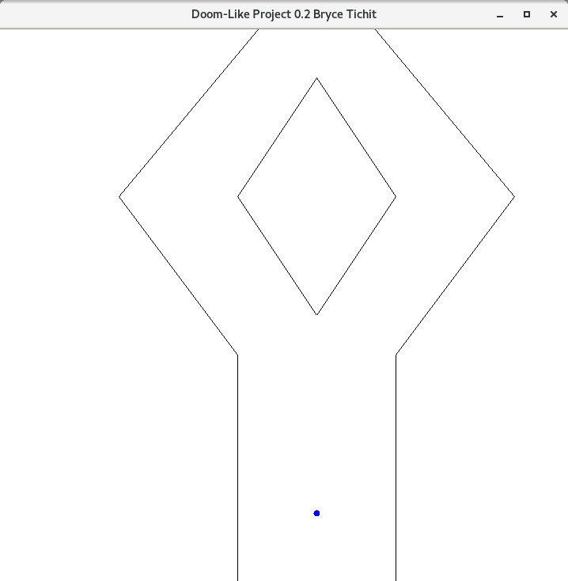
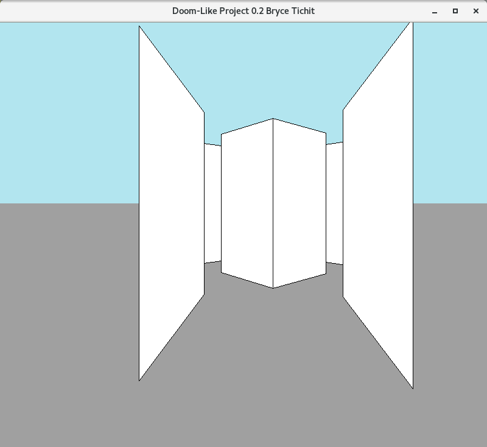
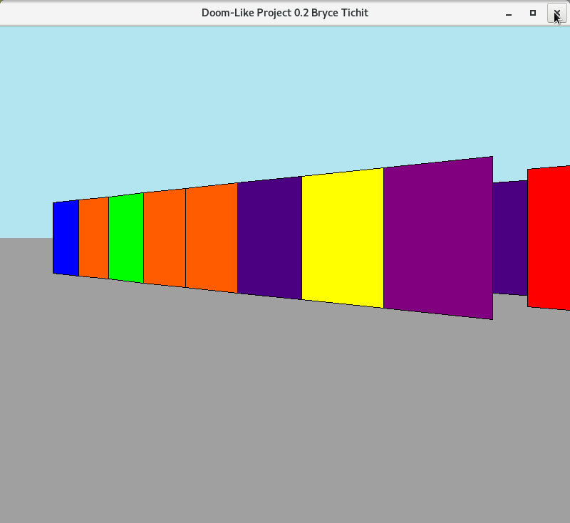

# projetPFA

Projet de simulation d'un moteur graphique à la DOOM en OCaml.

### Getting started
 - A recent version of OCaml is required
 - Ocaml-findlib, ocamllex, ocamldep and menhir are required
 - If all requirements of the above are meet, compile the projet with make
 - The resulting binary will be "projet\_pfa"
 
## Example

This program loads a labyrinth source, written with the following syntax

    P: Coordinates (x,y,z) of starting point in the map
    Coordinates of all the segments in the map, representing walls

______

    P : 400 100 90
    300 0 300 300
    500 0 500 300
    300 300 150 500
    500 300 650 500
    400 350 300 500
    400 350 500 500
    300 500 400 650
    500 500 400 650
    150 500 400 800
    650 500 400 800

We can now start the program with ./projet\_pfa source\_file.lab

While in the game you can move using ZQSD (WASD not supported)

Example with lab1.lab in 2D:

Example with lab1.lab in 3D:

A funny rainbow maze:

### Keys in game

  - e: Rotate the camera to the right by one
  - a: Rotate the camera to the left by one
  - c: Crouch
  - b: Rush mode
  - r: Teleport to the lab init position

There are others keys used for the debug mode but they're not documented here.

## Options

      usage: ./bsp file.lab
        -mode <2D      | 3D> 2D or 3D display
      -fov           field of vision (angle de vision)
      -dims          set the dimensions of the graph
      -scale         scale of the 2D map
      -map           set a minimap in the lower left corner
      -step          set the distance between two steps
      -xmin          set minimum distance of display
      -debug         debugging 2D rendering
      -debugbsp      debugging bsp
      -maze          generate random maze
      -mazesize      set size of maze
      -mazewidth     set width of maze's walls
      -xmax          set maximum distance of display
      -rainbow       set rainbow colors to walls
      -minimap_xmax  set maximum distance of display in minimap
      -help          Display this list of options
      --help         Display this list of options

